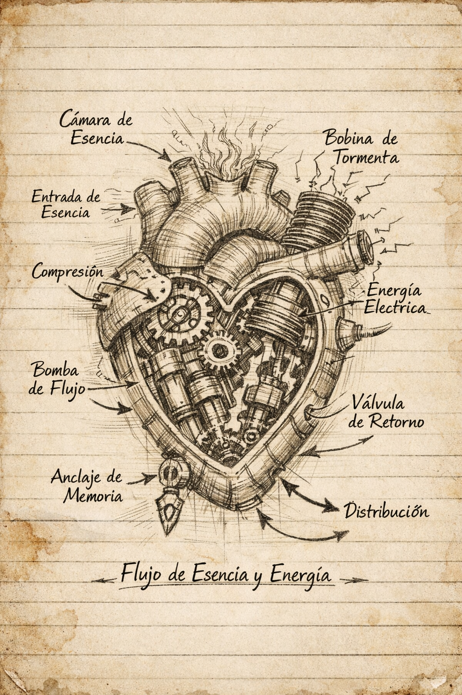

# Boceto del corazón mecánico (v0.3)

## Diferencia respecto a v0.1

Versión mejorada con:

- Cámara de Esencia
- Engranajes de compresión
- Pistón rítmico
- Bobina de Tormenta (excitación eléctrica, cuando esté totalmente cargada manda impulsos al cerebro)
- Válvula de Retorno

---

## Flujo

Esencia → Compresión → Excitación eléctrica → Distribución corporal

---

## Ventajas

- Flujo más constante
- Menor vibración
- Mejor respuesta al pulso del mesmerista

---

## Riesgos

- Complejidad excesiva
- Mantenimiento complicado
- Posible resonancia espectral

---

## Estado actual

- [x] Diseño teórico
- [ ] Prototipo físico
- [ ] Inserción de ancla de memoria
- [ ] Activación estable

---

> [!warning]- Observación
> Si el flujo se detiene, la esencia puede fragmentarse.
