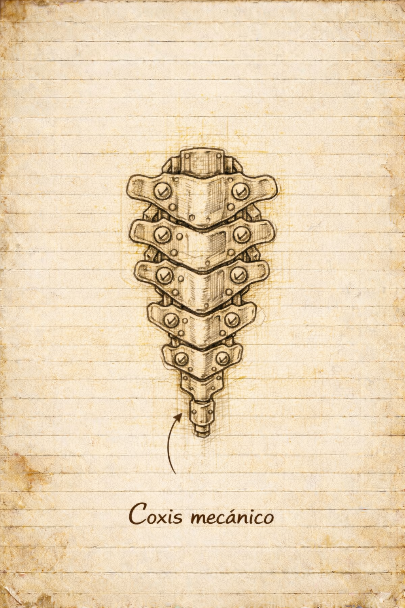

# Boceto de un cóccix mecánico básico

## Función

Base de anclaje estructural inferior.

Actúa como:

- Punto de conexión a la columna
- Soporte de estabilidad
- Distribuidor secundario hacia piernas

---

## Construcción

- Placas de hierro superpuestas
- Tornillos de fijación reforzados
- Estructura modular intercambiable

---

## Observaciones

No alberga esencia directamente.  
Solo transmite.

Debe mantenerse rígido.
A mejorar a futuro su forma y movilidad.
